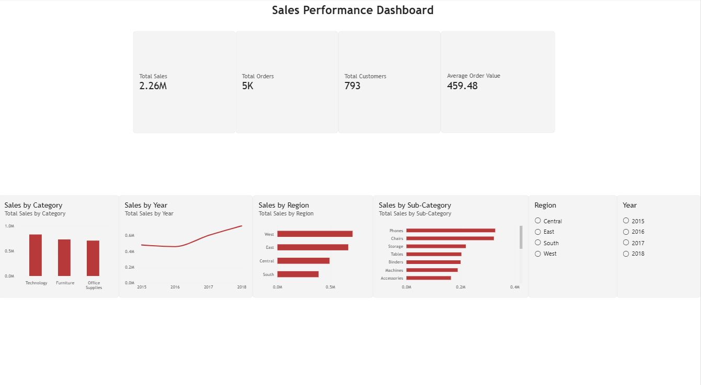

# Sales Data Analysis

A data analysis project using **SQL Server, T-SQL, and Power BI** to explore sales performance, customer behavior, and business trends.

## 📌 Project Overview

This project analyzes a sales dataset to identify patterns in sales performance across different categories, regions, customers, products, and years.

The project includes both **SQL analysis** and an interactive **Power BI dashboard**.

## 🛠️ Tools & Technologies

* SQL Server
* T-SQL
* Power BI
* DAX
* Microsoft Excel
* Git & GitHub

## 📊 Analysis Performed

### Sales Analysis

* Total sales
* Sales by category
* Sales by region
* Sales by sub-category
* Sales by year
* Sales by ship mode
* Sales by customer segment
* Top 5 cities by sales

### Customer Analysis

* Top 10 customers by sales
* Customers with sales above $10,000
* Number of orders per customer
* Customer sales and order analysis
* Average Order Value

## 📈 Key Findings

* Total Sales: **$2.26M**
* Total Orders: **4,922**
* Total Customers: **793**
* Average Order Value: **$459.48**
* **Technology** generated the highest sales among the three categories.
* **West** was the highest-selling region.
* **Phones** was the highest-selling sub-category.
* Sales increased substantially from 2016 to 2018, with **2018** having the highest annual sales.

## 📊 Power BI Dashboard

The interactive dashboard includes:

* Sales KPIs
* Sales by Category
* Sales by Year
* Sales by Region
* Sales by Sub-Category
* Year and Region filters
* Interactive cross-filtering



## 📁 Project Structure

```text
Sales-Data-Analysis/
│
├── README.md
│
├── data/
│   └── Superstore.csv
│
├── sql/
│   ├── 01_data_exploration.sql
│   ├── 02_sales_analysis.sql
│   └── 03_customer_analysis.sql
│
├── dashboard/
│   └── Sales_Dashboard.pbix
│
└── Images/
    └── dashboardpic.JPG
```

## 🎯 Project Goal

The goal of this project is to demonstrate practical skills in:

* Data exploration
* SQL querying
* Data aggregation
* Customer analysis
* KPI development
* Data visualization
* Power BI dashboard development
* Business-oriented data analysis

